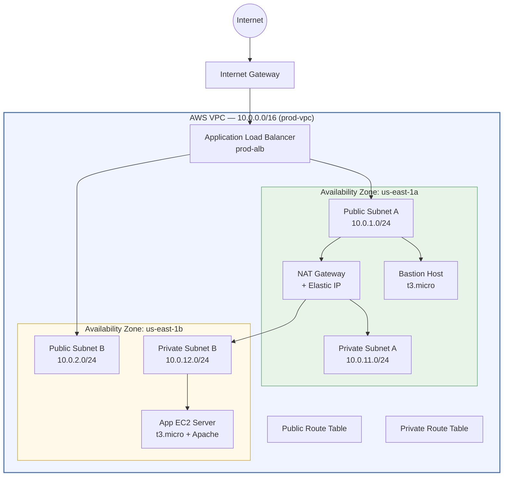
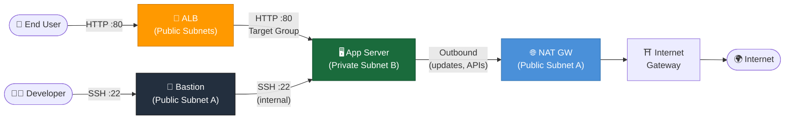
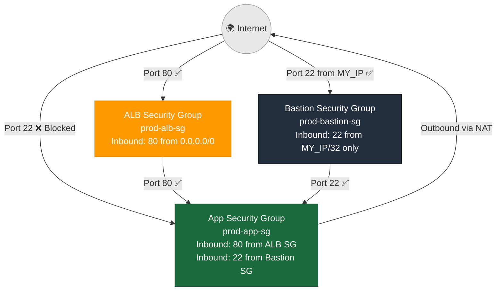
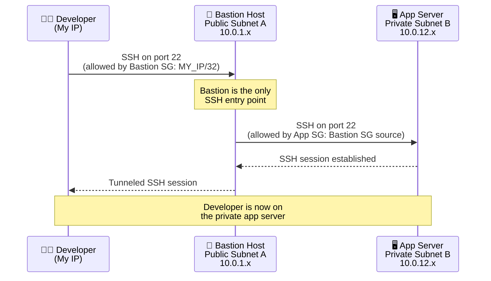
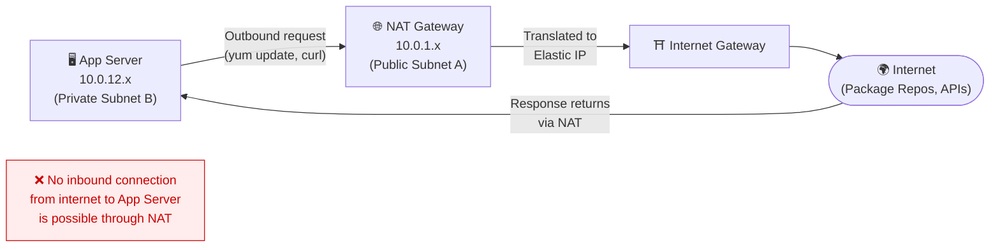
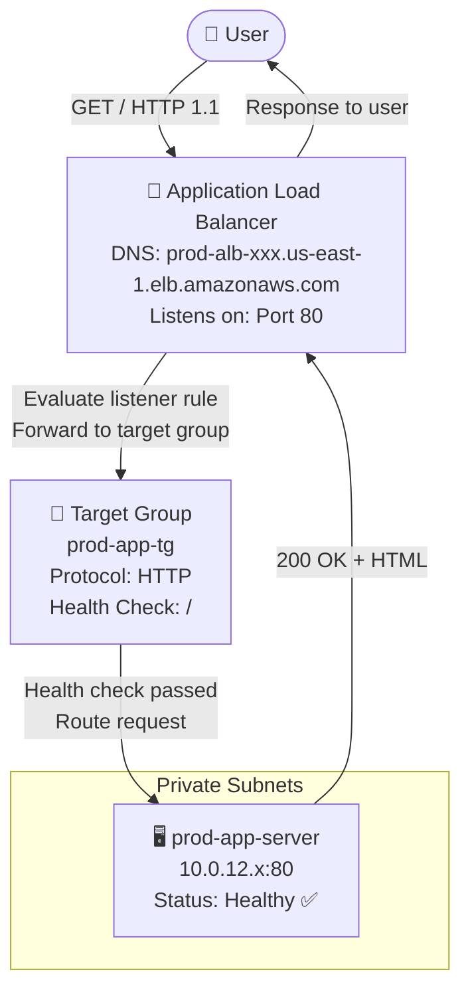

# Production-Style AWS VPC Architecture

> A hands-on cloud networking project that mirrors real-world AWS infrastructure patterns — built to demonstrate production-grade VPC design with layered security, high availability, and proper network segmentation.

---

## Table of Contents

1. [Project Overview](#project-overview)
2. [Architecture Summary](#architecture-summary)
3. [Real-World Use Case](#real-world-use-case)
4. [AWS Services Used](#aws-services-used)
5. [Network Design](#network-design)
6. [CIDR Planning Table](#cidr-planning-table)
7. [Subnet Allocation Table](#subnet-allocation-table)
8. [Route Table Configuration](#route-table-configuration)
9. [Security Group Rules](#security-group-rules)
10. [NACL Rules](#nacl-rules)
11. [EC2 Configuration](#ec2-configuration)
12. [Bastion Host Access Flow](#bastion-host-access-flow)
13. [Private Server Access Flow](#private-server-access-flow)
14. [Load Balancer Flow](#load-balancer-flow)
15. [Step-by-Step Deployment Guide](#step-by-step-deployment-guide)
16. [Terraform Commands](#terraform-commands)
17. [Validation Steps](#validation-steps)
18. [Testing Checklist](#testing-checklist)
19. [Expected Outputs](#expected-outputs)
20. [Security Best Practices Implemented](#security-best-practices-implemented)
21. [Troubleshooting Guide](#troubleshooting-guide)
22. [Cost Optimization Notes](#cost-optimization-notes)
23. [Project Cleanup Steps](#project-cleanup-steps)
24. [Future Improvements](#future-improvements)
25. [Resume Description](#resume-description)

---

## Project Overview

This project provisions a complete, production-style AWS Virtual Private Cloud (VPC) environment using Terraform. The architecture separates public-facing and private workloads across two Availability Zones, implements a bastion host pattern for secure administrative access, and exposes application traffic exclusively through an Application Load Balancer (ALB).

The goal was to build something that reflects what you'd actually encounter at a company running workloads on AWS — not a tutorial-grade single-subnet setup, but a properly segmented network with defense in depth through Security Groups, Network ACLs, and controlled routing.

Everything is defined as code, so the entire stack can be deployed, validated, and torn down repeatably. This makes it suitable for demos, interviews, and as a base for more complex projects.

---

## Architecture Summary



---

## Real-World Use Case

Imagine a small SaaS company running a web application. Their requirements are:

- **Public-facing web traffic** must pass through a managed load balancer for SSL termination, health checks, and distribution.
- **Application servers** must be isolated in private subnets — never directly reachable from the internet.
- **Engineers** need SSH access for debugging but only through a hardened jump box, not directly to app servers.
- **Outbound internet access** from private servers (for package updates, API calls) must be controlled through a NAT Gateway, not through open inbound ports.
- The stack must survive an **AZ failure** — hence resources span two AZs.

This project is the network foundation for exactly that kind of environment.

---

## AWS Services Used

| Service | Purpose |
|---|---|
| **VPC** | Isolated network boundary for all resources |
| **Subnets (Public × 2)** | Host internet-facing resources (ALB, Bastion) |
| **Subnets (Private × 2)** | Host application workloads with no direct internet exposure |
| **Internet Gateway** | Enables inbound/outbound internet access for public subnets |
| **NAT Gateway** | Allows private instances to reach the internet outbound only |
| **Elastic IP** | Static public IP address attached to the NAT Gateway |
| **Route Tables** | Control traffic flow within and outside the VPC |
| **Security Groups** | Stateful, instance-level firewall rules |
| **Network ACLs** | Stateless, subnet-level firewall rules (additional layer) |
| **EC2 (Bastion)** | Jump host in public subnet for secure SSH tunneling |
| **EC2 (App Server)** | Private Apache web server serving application content |
| **Application Load Balancer** | Layer 7 load balancer distributing traffic to the app tier |
| **Target Group** | Logical grouping of EC2 instances for ALB health checks |
| **IAM Key Pair** | SSH key-based authentication (no password auth) |

---

## Network Design

The VPC uses a `/16` block giving 65,536 IP addresses. This is split into clearly separated `/24` subnets — each holding 256 addresses — organized by tier (public vs private) and AZ (a vs b).

Public subnets are numbered in the `10.0.1.x` and `10.0.2.x` ranges. Private subnets jump to `10.0.11.x` and `10.0.12.x`. The gap between `10.0.3.x` through `10.0.10.x` is intentionally left open for future tiers (e.g., a database subnet group or a management subnet) without requiring a redesign.

### High-Level Network Traffic Flow



---

## CIDR Planning Table

| Component | CIDR Block | Usable IPs | Notes |
|---|---|---|---|
| VPC | `10.0.0.0/16` | 65,531 | Full private address space |
| Public Subnet A | `10.0.1.0/24` | 251 | AZ: us-east-1a |
| Public Subnet B | `10.0.2.0/24` | 251 | AZ: us-east-1b |
| *(Reserved)* | `10.0.3.0/24 – 10.0.10.0/24` | — | Future expansion |
| Private Subnet A | `10.0.11.0/24` | 251 | AZ: us-east-1a |
| Private Subnet B | `10.0.12.0/24` | 251 | AZ: us-east-1b |

> AWS reserves 5 IPs per subnet (first 4 + last 1), so a /24 gives 251 usable addresses.

---

## Subnet Allocation Table

| Subnet Name | CIDR | AZ | Type | Resources Hosted |
|---|---|---|---|---|
| prod-public-subnet-a | 10.0.1.0/24 | us-east-1a | Public | Bastion Host, NAT GW, ALB node |
| prod-public-subnet-b | 10.0.2.0/24 | us-east-1b | Public | ALB node |
| prod-private-subnet-a | 10.0.11.0/24 | us-east-1a | Private | (Reserved for future app tier) |
| prod-private-subnet-b | 10.0.12.0/24 | us-east-1b | Private | App EC2 Server |

---

## Route Table Configuration

### Public Route Table (`prod-public-rt`)

| Destination | Target | Purpose |
|---|---|---|
| `10.0.0.0/16` | local | VPC-internal routing |
| `0.0.0.0/0` | Internet Gateway | All other traffic goes to internet |

**Associated with:** prod-public-subnet-a, prod-public-subnet-b

### Private Route Table (`prod-private-rt`)

| Destination | Target | Purpose |
|---|---|---|
| `10.0.0.0/16` | local | VPC-internal routing |
| `0.0.0.0/0` | NAT Gateway | Outbound internet via NAT (no inbound) |

**Associated with:** prod-private-subnet-a, prod-private-subnet-b

---

## Security Group Rules

### Bastion Host SG (`prod-bastion-sg`)

| Direction | Protocol | Port | Source | Reason |
|---|---|---|---|---|
| Inbound | TCP | 22 | Your IP /32 | SSH access locked to admin IP only |
| Outbound | All | All | 0.0.0.0/0 | Allow all outbound (updates, SSH forwarding) |

### ALB Security Group (`prod-alb-sg`)

| Direction | Protocol | Port | Source | Reason |
|---|---|---|---|---|
| Inbound | TCP | 80 | 0.0.0.0/0 | Accept HTTP from any internet user |
| Outbound | TCP | 80 | App SG | Forward traffic to app servers only |

### App Server SG (`prod-app-sg`)

| Direction | Protocol | Port | Source | Reason |
|---|---|---|---|---|
| Inbound | TCP | 80 | ALB SG | Only accept HTTP from the load balancer |
| Inbound | TCP | 22 | Bastion SG | Only accept SSH from bastion host |
| Outbound | All | All | 0.0.0.0/0 | Allow outbound (NAT handles internet) |

### Security Layer Diagram



---

## NACL Rules

NACLs act as a stateless subnet-level firewall — a secondary control layer outside of Security Groups. Because they're stateless, both inbound and outbound rules must explicitly permit return traffic.

### Public Subnet NACL (`prod-public-nacl`)

**Inbound:**

| Rule # | Protocol | Port Range | Source | Action |
|---|---|---|---|---|
| 100 | TCP | 80 | 0.0.0.0/0 | ALLOW |
| 110 | TCP | 443 | 0.0.0.0/0 | ALLOW |
| 120 | TCP | 22 | 0.0.0.0/0 | ALLOW |
| 130 | TCP | 1024–65535 | 0.0.0.0/0 | ALLOW (ephemeral ports) |
| * | All | All | 0.0.0.0/0 | DENY |

**Outbound:**

| Rule # | Protocol | Port Range | Destination | Action |
|---|---|---|---|---|
| 100 | TCP | 80 | 0.0.0.0/0 | ALLOW |
| 110 | TCP | 443 | 0.0.0.0/0 | ALLOW |
| 120 | TCP | 22 | 0.0.0.0/0 | ALLOW |
| 130 | TCP | 1024–65535 | 0.0.0.0/0 | ALLOW (ephemeral ports) |
| * | All | All | 0.0.0.0/0 | DENY |

### Private Subnet NACL (`prod-private-nacl`)

**Inbound:**

| Rule # | Protocol | Port Range | Source | Action |
|---|---|---|---|---|
| 100 | TCP | 80 | 10.0.0.0/16 | ALLOW (from ALB in VPC) |
| 110 | TCP | 22 | 10.0.1.0/24 | ALLOW (from Bastion subnet) |
| 120 | TCP | 1024–65535 | 0.0.0.0/0 | ALLOW (return traffic via NAT) |
| * | All | All | 0.0.0.0/0 | DENY |

**Outbound:**

| Rule # | Protocol | Port Range | Destination | Action |
|---|---|---|---|---|
| 100 | TCP | 80 | 0.0.0.0/0 | ALLOW |
| 110 | TCP | 443 | 0.0.0.0/0 | ALLOW |
| 120 | TCP | 1024–65535 | 10.0.0.0/16 | ALLOW (response to VPC traffic) |
| * | All | All | 0.0.0.0/0 | DENY |

---

## EC2 Configuration

| Parameter | Bastion Host | App Server |
|---|---|---|
| **Name** | prod-bastion | prod-app-server |
| **Instance Type** | t3.micro | t3.micro |
| **AMI** | Amazon Linux 2023 | Amazon Linux 2023 |
| **Subnet** | prod-public-subnet-a | prod-private-subnet-b |
| **Public IP** | Yes (auto-assigned) | No |
| **Key Pair** | prod-vpc-key | prod-vpc-key |
| **User Data** | bastion-userdata.sh | private-app-userdata.sh |
| **Security Group** | prod-bastion-sg | prod-app-sg |

---

## Bastion Host Access Flow



**SSH Command Example:**
```bash
# Step 1: Connect to Bastion
ssh -i prod-vpc-key.pem ec2-user@<BASTION_PUBLIC_IP>

# Step 2: From Bastion, connect to App Server
ssh -i prod-vpc-key.pem ec2-user@<APP_PRIVATE_IP>

# Or use SSH Agent Forwarding (recommended):
ssh-add prod-vpc-key.pem
ssh -A -i prod-vpc-key.pem ec2-user@<BASTION_PUBLIC_IP>
# Then from bastion:
ssh ec2-user@<APP_PRIVATE_IP>
```

---

## Private Server Access Flow

The app server has no public IP. It communicates outbound through the NAT Gateway for package updates and API calls. Inbound traffic only comes from the ALB (port 80) or the Bastion (port 22).



---

## Load Balancer Flow

The ALB sits across both public subnets, providing fault tolerance. It checks the health of the app server on port 80 and only routes traffic to healthy targets.



---

## Step-by-Step Deployment Guide

### Prerequisites

Before deploying, make sure you have the following installed and configured:

```bash
# Check Terraform version (1.5+ required)
terraform version

# Check AWS CLI version
aws --version

# Verify AWS credentials are configured
aws sts get-caller-identity
```

You'll also need:
- An **AWS account** with permissions to create VPCs, EC2, ALB, and IAM resources
- An **EC2 Key Pair** created in your target region (us-east-1 by default)
- Your **public IP address** for the bastion SSH rule — find it at https://checkip.amazonaws.com

### Step 1 — Clone/Download the Project

```bash
git clone https://github.com/<your-username>/production-aws-vpc.git
cd production-aws-vpc
```

### Step 2 — Create Your EC2 Key Pair

```bash
# Create key pair and save the .pem file
aws ec2 create-key-pair \
  --key-name prod-vpc-key \
  --region us-east-1 \
  --query 'KeyMaterial' \
  --output text > prod-vpc-key.pem

# Set correct permissions
chmod 400 prod-vpc-key.pem
```

### Step 3 — Update terraform.tfvars

Open `terraform.tfvars` and update the values:

```hcl
# Replace with your actual public IP (from checkip.amazonaws.com)
my_ip = "203.0.113.42/32"

# Must match the key pair name you created above
key_pair_name = "prod-vpc-key"
```

### Step 4 — Initialize Terraform

```bash
terraform init
```

This downloads the AWS provider plugin and sets up the backend.

### Step 5 — Review the Plan

```bash
terraform plan -out=tfplan
```

Review the output carefully. You should see **~35–40 resources** planned for creation.

### Step 6 — Apply the Configuration

```bash
terraform apply tfplan
```

Type `yes` when prompted. Deployment takes approximately **3–5 minutes**, primarily waiting for the NAT Gateway to become available.

### Step 7 — Capture the Outputs

```bash
terraform output
```

Save the ALB DNS name and Bastion public IP for testing.

---

## Terraform Commands

```bash
# Initialize the working directory
terraform init

# Format all .tf files
terraform fmt

# Validate configuration syntax
terraform validate

# Preview changes
terraform plan

# Apply changes
terraform apply

# Apply without interactive prompt (use in CI/CD)
terraform apply -auto-approve

# Destroy all resources
terraform destroy

# Target a specific resource
terraform apply -target=aws_instance.bastion

# Show current state
terraform show

# List resources in state
terraform state list

# Refresh state from real AWS resources
terraform refresh
```

---

## Validation Steps

After deployment, run these checks to confirm everything is working:

### 1. VPC and Subnet Check
```bash
VPC_ID=$(terraform output -raw vpc_id)
aws ec2 describe-subnets \
  --filters "Name=vpc-id,Values=$VPC_ID" \
  --query 'Subnets[*].{Name:Tags[?Key==`Name`].Value|[0],CIDR:CidrBlock,AZ:AvailabilityZone,Public:MapPublicIpOnLaunch}' \
  --output table
```

### 2. Route Table Check
```bash
aws ec2 describe-route-tables \
  --filters "Name=vpc-id,Values=$VPC_ID" \
  --query 'RouteTables[*].{Name:Tags[?Key==`Name`].Value|[0],Routes:Routes}' \
  --output json
```

### 3. NAT Gateway Check
```bash
aws ec2 describe-nat-gateways \
  --filter "Name=vpc-id,Values=$VPC_ID" \
  --query 'NatGateways[*].{State:State,SubnetId:SubnetId}' \
  --output table
```

### 4. ALB Health Check
```bash
ALB_DNS=$(terraform output -raw alb_dns_name)
curl -I http://$ALB_DNS
# Expected: HTTP/1.1 200 OK
```

### 5. Bastion SSH Test
```bash
BASTION_IP=$(terraform output -raw bastion_public_ip)
ssh -i prod-vpc-key.pem -o ConnectTimeout=10 ec2-user@$BASTION_IP "echo 'Bastion reachable'"
```

### 6. App Server via Bastion
```bash
APP_IP=$(terraform output -raw app_server_private_ip)
ssh -i prod-vpc-key.pem -J ec2-user@$BASTION_IP ec2-user@$APP_IP "curl -s localhost"
```

---

## Testing Checklist

Use this checklist to verify the deployment is correct before considering it production-ready:

**Network Layer**
- [ ] VPC created with CIDR `10.0.0.0/16`
- [ ] 4 subnets created across 2 AZs (2 public, 2 private)
- [ ] Internet Gateway attached to VPC
- [ ] NAT Gateway in public subnet with Elastic IP
- [ ] Public route table has `0.0.0.0/0 → IGW`
- [ ] Private route table has `0.0.0.0/0 → NAT GW`
- [ ] Both public subnets associated with public route table
- [ ] Both private subnets associated with private route table

**Security Layer**
- [ ] Bastion SG only allows SSH from your IP
- [ ] ALB SG allows HTTP from 0.0.0.0/0
- [ ] App SG only allows HTTP from ALB SG (not from internet)
- [ ] App SG only allows SSH from Bastion SG (not from internet)
- [ ] NACLs applied to correct subnets
- [ ] Direct SSH to app server IP fails (connection refused/timeout)

**Connectivity**
- [ ] ALB DNS name returns HTTP 200
- [ ] HTML page shows hostname and private IP
- [ ] SSH to bastion succeeds from your IP
- [ ] SSH to app server from bastion succeeds
- [ ] App server can reach internet outbound (via NAT)
- [ ] App server has no public IP assigned

**Load Balancer**
- [ ] Target group shows app server as "Healthy"
- [ ] ALB listener on port 80 forwards to target group
- [ ] ALB spans both public subnets

---

## Expected Outputs

After `terraform apply`, the following outputs will be displayed:

```
alb_dns_name        = "prod-alb-1234567890.us-east-1.elb.amazonaws.com"
app_server_private_ip = "10.0.12.45"
bastion_public_ip   = "54.210.xxx.xxx"
nat_gateway_ip      = "34.228.xxx.xxx"
private_subnet_ids  = [
  "subnet-0abc123def456",
  "subnet-0def456abc789",
]
public_subnet_ids   = [
  "subnet-0111aaa222bbb",
  "subnet-0333ccc444ddd",
]
vpc_id              = "vpc-0a1b2c3d4e5f6"
```

**Verify the web page:**
```bash
curl http://$(terraform output -raw alb_dns_name)
```

Expected HTML response:
```html
<!DOCTYPE html>
<html>
<body style="font-family: monospace; background: #1a1a2e; color: #00ff88; padding: 40px;">
  <h1>Production App Server</h1>
  <p>Hostname: ip-10-0-12-45.ec2.internal</p>
  <p>Private IP: 10.0.12.45</p>
  <p>Environment: Production</p>
  <p>Status: Healthy ✅</p>
</body>
</html>
```

---

## Security Best Practices Implemented

| Practice | Implementation |
|---|---|
| **Principle of Least Privilege** | Each security group only allows the minimum required ports from specific sources |
| **No Direct Internet Access to App Tier** | App servers have no public IP; all inbound comes through ALB |
| **Bastion Pattern** | SSH access to private instances only via jump host |
| **Source IP Restriction** | Bastion SSH locked to admin IP, not 0.0.0.0/0 |
| **Security Group Chaining** | App SG references ALB SG and Bastion SG as sources (not CIDR blocks) |
| **Defense in Depth** | NACLs at subnet level + Security Groups at instance level |
| **Private Subnets** | Application workloads isolated from direct internet traffic |
| **NAT Gateway for Outbound** | Private instances reach internet without being reachable inbound |
| **Multi-AZ Deployment** | Resources distributed across AZs for fault tolerance |
| **No Hardcoded Credentials** | All sensitive values in variables, no secrets in code |
| **Resource Tagging** | Every resource tagged with Name, Environment, Project, and ManagedBy |
| **Key-Based Auth Only** | EC2 instances use SSH key pairs, no password authentication |

---

## Troubleshooting Guide

### ALB Returns 502 Bad Gateway
**Symptom:** `curl http://<ALB_DNS>` returns 502  
**Cause:** App server is unhealthy or Apache isn't running  
**Fix:**
```bash
# SSH to app server via bastion, check Apache status
sudo systemctl status httpd
sudo systemctl start httpd

# Check target group health
aws elbv2 describe-target-health \
  --target-group-arn $(terraform output -raw target_group_arn)
```

### Bastion SSH Timeout
**Symptom:** `ssh` hangs with no response  
**Cause:** Your IP has changed, or Bastion SG rule is incorrect  
**Fix:**
```bash
# Check your current IP
curl https://checkip.amazonaws.com

# Update my_ip in terraform.tfvars and re-apply
terraform apply -target=aws_security_group.bastion_sg
```

### NAT Gateway Not Routing
**Symptom:** App server can't install packages (`yum update` fails)  
**Cause:** Private route table missing 0.0.0.0/0 → NAT GW route  
**Fix:**
```bash
# Verify NAT GW is in Available state
aws ec2 describe-nat-gateways --query 'NatGateways[*].{State:State,Id:NatGatewayId}'

# Check private route table
aws ec2 describe-route-tables \
  --filters "Name=tag:Name,Values=prod-private-rt"
```

### App Server Not in Target Group
**Symptom:** Target group shows 0 healthy targets  
**Cause:** Health check failing (Apache not running or wrong port)  
**Fix:**
```bash
# From bastion, test Apache directly
ssh ec2-user@<APP_IP> "curl -s localhost:80"

# Check user data script ran correctly
sudo cat /var/log/cloud-init-output.log
```

### Terraform State Errors
**Symptom:** Resources already exist in AWS but Terraform doesn't know about them  
**Fix:**
```bash
# Import existing resource into state
terraform import aws_vpc.main vpc-xxxxxxxxx

# Or destroy and recreate cleanly
terraform destroy
terraform apply
```

---

## Cost Optimization Notes

This architecture, while production-style, has some costs to be aware of:

| Resource | Estimated Cost |
|---|---|
| NAT Gateway | ~$0.045/hr + $0.045/GB data processed |
| EC2 t3.micro (×2) | ~$0.0104/hr each (or free tier eligible) |
| ALB | ~$0.008/hr + LCU charges |
| Elastic IP (unattached) | $0.005/hr (free when attached) |
| **Total estimate** | ~$40–60/month if left running |

**Cost saving tips:**
- Use **t3.micro** or **t2.micro** (free tier) for EC2 instances during testing
- **Destroy when not in use** — `terraform destroy` removes everything
- If you don't need multi-AZ, use a single NAT GW (biggest cost driver)
- Use **Savings Plans** or **Reserved Instances** for production workloads
- Consider **NAT Instance** (instead of NAT Gateway) for dev environments — cheaper but less managed

---

## Project Cleanup Steps

**Important:** Always clean up to avoid ongoing AWS charges.

```bash
# Step 1: Preview what will be destroyed
terraform plan -destroy

# Step 2: Destroy all resources
terraform destroy

# Type 'yes' when prompted
# Wait for completion (~3-5 minutes)

# Step 3: Verify in AWS Console or via CLI
aws ec2 describe-vpcs \
  --filters "Name=tag:Name,Values=prod-vpc" \
  --query 'Vpcs[*].VpcId'
# Should return empty: []

# Step 4: Clean up the key pair if no longer needed
aws ec2 delete-key-pair --key-name prod-vpc-key
rm -f prod-vpc-key.pem
```

---

## Future Improvements

These are natural next steps to extend this architecture:

1. **RDS in Private Subnets** — Add a database subnet group and RDS instance in private subnets, accessible only from the app tier
2. **HTTPS with ACM** — Add an SSL certificate via AWS Certificate Manager and configure ALB HTTPS listener (port 443) with HTTP → HTTPS redirect
3. **Auto Scaling Group** — Replace the single app EC2 with an ASG to handle load and replace unhealthy instances automatically
4. **S3 VPC Endpoint** — Add a Gateway VPC endpoint for S3 to avoid sending S3 traffic through the NAT Gateway (reduces cost)
5. **CloudWatch Alarms** — Add monitoring for ALB 5xx errors, EC2 CPU, and NAT Gateway bandwidth
6. **VPC Flow Logs** — Enable flow logs to an S3 bucket or CloudWatch for network traffic analysis and security auditing
7. **Secrets Manager** — Store application secrets (DB passwords, API keys) in Secrets Manager rather than environment variables
8. **WAF on ALB** — Add AWS WAF to the ALB to protect against common web exploits
9. **Remote Terraform State** — Use an S3 backend with DynamoDB locking instead of local state
10. **Terraform Modules** — Refactor into reusable modules (vpc, compute, alb) for multi-environment deployments

---

## Resume Description

> **Production-Style AWS VPC Architecture** | Terraform | AWS Networking
>
> Designed and deployed a multi-AZ AWS VPC environment following production networking best practices using Terraform IaC. Architecture includes public/private subnet segmentation across two Availability Zones, Internet Gateway and NAT Gateway for controlled traffic flow, an Application Load Balancer for HTTP traffic distribution, and a bastion host pattern for secure SSH access to private EC2 instances. Implemented defense-in-depth security using both Security Groups (stateful, instance-level) and Network ACLs (stateless, subnet-level). All infrastructure defined as code with parameterized variables, proper resource tagging, and documented deployment procedures.
>
> **Technologies:** AWS VPC, EC2, ALB, NAT Gateway, Terraform, Amazon Linux 2023, Apache HTTP Server

---

*Built as a hands-on cloud networking study project — every design decision here reflects patterns used in real AWS production environments.*
